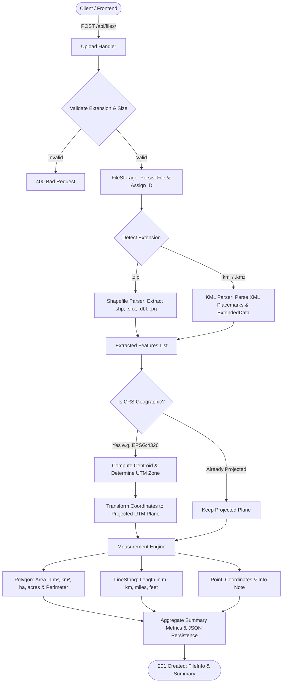

# 🌍 Geospatial File Measurement API

[](https://www.python.org/downloads/)
[](https://fastapi.tiangolo.com)
[](https://pytest.org)
[](https://opensource.org/licenses/MIT)

A high-performance, production-grade backend service built with **FastAPI**, **Shapely**, and **PyProj** that accepts geospatial vector files (**Shapefiles** in `.zip` archives and **KML / KMZ** files), parses geospatial features, performs automatic **Coordinate Reference System (CRS) transformations** to optimal local **UTM (Universal Transverse Mercator)** projections, and calculates precise geometric measurements (**Area** for Polygons, **Length** for LineStrings).

---

## 📌 Project Overview & Problem Statement

Geospatial data comes in varied file formats and coordinate systems. Calculating geometric measurements (such as parcel area or road length) directly using angular geographic coordinates (latitude and longitude in degrees, e.g., `EPSG:4326` / WGS84) introduces severe distortions because degrees do not have constant physical metric dimensions across the globe.

### Objective
Build a robust, clean, and extensible REST API service that:
1. Accepts geospatial files: **Shapefile (`.zip`)** and **KML (`.kml`, `.kmz`)**.
2. Reads geospatial data and extracts feature attributes, geometry type, coordinates, and CRS.
3. Automatically identifies geographic coordinates and transforms them into an optimal local projected coordinate system (**UTM Zone**) before computing measurements.
4. Calculates **Area & Perimeter** for Polygons/MultiPolygons (including inner exclusion holes) and **Length** for LineStrings/MultiLineStrings.
5. Gracefully handles unsupported geometries (Points, Collections, or invalid shapes) without crashing.
6. Provides clean, documented REST endpoints and an interactive web map dashboard.

---

## 📋 Requirements Compliance Matrix

| Requirement | Specification | Implementation in this API |
| :--- | :--- | :--- |
| **Backend Framework** | FastAPI or Django+DRF | **FastAPI (v0.110+)** with **Pydantic v2** for async performance, automatic OpenAPI 3.1 docs, and strict type safety. |
| **File Upload** | `POST /api/files/` accepting `.zip` Shapefile & `.kml` | Multipart upload supporting `.zip` (with `.shp`, `.shx`, `.dbf`, `.prj`), `.kml`, and compressed `.kmz` files up to 100MB. |
| **Feature Extraction** | ID, Geometry Type, Geometry, CRS, Properties | Extracted with GeoJSON serialization and DBF/ExtendedData attribute preservation. |
| **Measurements** | Polygon $\rightarrow$ Area; LineString $\rightarrow$ Length; Point $\rightarrow$ No measurement | Computes area in $m^2$, $km^2$, hectares, acres; length in meters, $km$, miles, feet; coordinates for points. |
| **CRS Handling** | Transform geographic CRS (e.g. `EPSG:4326`) to projected CRS | Dynamic Auto-UTM zone detection based on feature centroids $(\lambda, \phi)$, projecting to EPSG:32601-32660 (North) or EPSG:32701-32760 (South). |
| **API Endpoints** | Upload, File Info, Measurements | `POST /api/files/`, `GET /api/files/`, `GET /api/files/{id}/`, `GET /api/files/{id}/measurements/`, `GET /api/files/{id}/geojson/`, `DELETE /api/files/{id}/`. |
| **Documentation** | Setup, API docs, Architecture, Design Decisions | Complete `README.md`, interactive Swagger at `/docs`, ReDoc at `/redoc`, and Docker orchestration. |

---

## 🛠 Technology Stack

- **Backend Web Framework**: [FastAPI](https://fastapi.tiangolo.com/) (Python 3.11+)
- **Data Validation & Serialization**: [Pydantic v2](https://docs.pydantic.dev/)
- **Geometry Operations**: [Shapely](https://shapely.readthedocs.io/) (GEOS C library wrapper)
- **Cartographic Projections & CRS**: [PyProj](https://pyproj4.github.io/pyproj/) (PROJ library wrapper)
- **Shapefile Parsing**: [PyShp](https://pypi.org/project/pyshp/) (Pure Python shapefile & DBF reader/writer)
- **XML / KML Parsing**: Python `xml.etree.ElementTree` with namespace normalization & sanitization
- **ASGI Server**: [Uvicorn](https://www.uvicorn.org/)
- **Testing & Quality Assurance**: [Pytest](https://pytest.org/) & [HTTPX](https://www.python-httpx.org/)
- **Containerization**: [Docker](https://www.docker.com/) & [Docker Compose](https://docs.docker.com/compose/)
- **Frontend Dashboard**: HTML5, Vanilla CSS (Glassmorphism Dark Theme), [Leaflet.js](https://leafletjs.com/)

---

## 🏛 System Architecture & Data Flow

```
Geospatial-File-Measurement-API/
├── app/
│   ├── config.py                 # Application settings, storage paths, file limits
│   ├── main.py                   # FastAPI app instance, CORS middleware, route mounting
│   ├── models/
│   │   ├── __init__.py
│   │   └── schemas.py            # Pydantic data contracts (Requests, Responses, Summaries)
│   ├── services/
│   │   ├── crs_service.py        # CRS parsing, centroid math, dynamic UTM projection
│   │   ├── measurement_service.py# Planar metric area, length, perimeter calculations
│   │   ├── processor.py          # Orchestration pipeline (Upload -> Parse -> CRS -> Measure)
│   │   ├── file_storage.py       # Thread-safe persistent file & metadata catalog
│   │   └── parsers/
│   │       ├── base.py           # Abstract Base Parser interface
│   │       ├── shapefile_parser.py # Shapefile zip unpacker & DBF parser
│   │       └── kml_parser.py     # XML Placemark & MultiGeometry extractor
│   ├── routers/
│   │   ├── files.py              # REST API endpoints for file lifecycle & measurements
│   │   └── health.py             # Health check & capabilities endpoint
│   └── static/                   # Interactive Leaflet Web Dashboard
│       ├── index.html
│       ├── css/style.css
│       └── js/app.js
├── tests/
│   ├── conftest.py               # Pytest test client fixtures
│   ├── test_api.py               # REST API integration test suite
│   ├── test_measurements.py      # Mathematics & CRS projection unit tests
│   └── test_parsers.py           # Shapefile & KML parser unit tests
├── sample_data/                  # Test datasets
│   ├── survey_dataset.kml        # KML with Polygons, LineStrings, Points
│   ├── sample_parcels_shapefile.zip # Shapefile archive with .shp, .shx, .dbf, .prj
│   └── create_samples.py         # Test dataset generator script
├── Dockerfile
├── docker-compose.yml
├── requirements.txt
└── README.md
```

### Processing Pipeline


---

## 🌐 Coordinate Reference System (CRS) & Projection Math

### The Distortion Problem with Angular Degrees
Coordinates in **WGS84 (`EPSG:4326`)** represent angles on an ellipsoid:
- Longitude $(\lambda) \in [-180^\circ, +180^\circ]$
- Latitude $(\phi) \in [-90^\circ, +90^\circ]$

Because Earth is curved, $1^\circ$ of longitude equals $\approx 111.32 \text{ km}$ at the equator but shrinks to $0 \text{ km}$ at the poles:
$$\Delta x \approx 111320 \times \cos(\phi) \text{ meters}$$

Calculating Euclidean area $\iint dx\,dy$ or line length $\sqrt{\Delta x^2 + \Delta y^2}$ directly on degree values produces meaningless, mathematically distorted numbers.

### Dynamic Auto-UTM Projection
Our service dynamically projects geometries onto their conformal **Universal Transverse Mercator (UTM)** zone:
1. **Centroid Extraction**:
   $$\lambda_c = \frac{1}{N}\sum_{i=1}^N \lambda_i, \quad \phi_c = \frac{1}{N}\sum_{i=1}^N \phi_i$$
2. **Zone Calculation**:
   $$\text{Zone} = \left\lfloor \frac{\lambda_c + 180}{6} \right\rfloor + 1 \quad (1 \le \text{Zone} \le 60)$$
3. **EPSG Code Resolution**:
   $$\text{EPSG} = \begin{cases} 32600 + \text{Zone}, & \text{if } \phi_c \ge 0^\circ \text{ (Northern Hemisphere)} \\ 32700 + \text{Zone}, & \text{if } \phi_c < 0^\circ \text{ (Southern Hemisphere)} \end{cases}$$
4. **Metric Transformation**:
   The coordinates are transformed via PROJ:
   $$(\lambda, \phi) \xrightarrow{\text{PyProj Transformer}} (X, Y) \text{ in meters}$$
5. **Exact Measurement Calculation**:
   - **Polygon Area**: Green's Theorem on projected coordinates, automatically subtracting inner rings (holes).
   - **LineString Length**: Segment-by-segment Euclidean summation $\sum \sqrt{(X_{i+1}-X_i)^2 + (Y_{i+1}-Y_i)^2}$.

---

## 📖 API Reference & Examples

### 1. Upload & Process File
- **Endpoint**: `POST /api/files/`
- **Content-Type**: `multipart/form-data`
- **Supported Formats**: `.zip` (Shapefile archive) and `.kml` / `.kmz`

**Example Request:**
```bash
curl -X POST "http://localhost:8000/api/files/" \
  -H "accept: application/json" \
  -F "file=@sample_data/survey_dataset.kml"
```

**Example Response (`201 Created`):**
```json
{
  "id": "78a9c12b04f1",
  "filename": "survey_dataset.kml",
  "feature_count": 6,
  "crs": "EPSG:4326",
  "status": "COMPLETED",
  "file_format": "KML",
  "file_size_bytes": 3542,
  "geometry_types": [
    "LineString",
    "Point",
    "Polygon"
  ],
  "created_at": "2026-10-09T16:50:00.123456+00:00",
  "error_message": null
}
```

---

### 2. Get File Information
- **Endpoint**: `GET /api/files/{id}/`

**Example Request:**
```bash
curl -X GET "http://localhost:8000/api/files/78a9c12b04f1/"
```

**Example Response (`200 OK`):**
```json
{
  "id": "78a9c12b04f1",
  "filename": "survey_dataset.kml",
  "feature_count": 6,
  "crs": "EPSG:4326",
  "status": "COMPLETED",
  "file_format": "KML",
  "file_size_bytes": 3542,
  "geometry_types": [
    "LineString",
    "Point",
    "Polygon"
  ],
  "created_at": "2026-10-09T16:50:00.123456+00:00",
  "error_message": null
}
```

---

### 3. Get File Measurements
- **Endpoint**: `GET /api/files/{id}/measurements/`
- **Optional Query Parameters**:
  - `geometry_type`: Filter features (`Polygon`, `LineString`, `Point`)
  - `page`: Page index (default: `1`)
  - `limit`: Number of items per page (default: `100`, max: `500`)

**Example Request:**
```bash
curl -X GET "http://localhost:8000/api/files/78a9c12b04f1/measurements/?geometry_type=Polygon"
```

**Example Response (`200 OK`):**
```json
{
  "file_id": "78a9c12b04f1",
  "filename": "survey_dataset.kml",
  "source_crs": "EPSG:4326",
  "status": "COMPLETED",
  "summary": {
    "total_features": 6,
    "polygon_count": 2,
    "linestring_count": 2,
    "point_count": 2,
    "other_count": 0,
    "total_area_sq_meters": 1395821.432,
    "total_area_sq_km": 1.395821,
    "total_area_hectares": 139.582143,
    "total_area_acres": 344.914,
    "total_length_meters": 8342.125,
    "total_length_km": 8.342125
  },
  "features": [
    {
      "feature_id": "parcel_01",
      "geometry_type": "Polygon",
      "geometry": {
        "type": "Polygon",
        "coordinates": [
          [
            [77.58, 12.97],
            [77.585, 12.97],
            [77.585, 12.975],
            [77.58, 12.975],
            [77.58, 12.97]
          ]
        ]
      },
      "crs": "EPSG:4326",
      "properties": {
        "name": "Agri Parcel Alpha",
        "zone_type": "Agricultural",
        "crop": "Basmati Rice"
      },
      "measurement": {
        "area": {
          "sq_meters": 303421.152,
          "sq_kilometers": 0.303421,
          "hectares": 30.342115,
          "acres": 74.9768,
          "perimeter_meters": 2208.45,
          "perimeter_kilometers": 2.20845
        },
        "length": null,
        "calculated_crs": "EPSG:32643 (UTM Zone 43N)",
        "method": "planar_projected_utm",
        "measurement_note": null
      }
    }
  ]
}
```

---

### 4. Export as GeoJSON FeatureCollection
- **Endpoint**: `GET /api/files/{id}/geojson/`
- **Description**: Returns all features with computed measurements embedded in properties for direct rendering in Leaflet, Mapbox, QGIS, or ArcGIS.

### 5. List Uploaded Files
- **Endpoint**: `GET /api/files/`

### 6. Delete File
- **Endpoint**: `DELETE /api/files/{id}/`

### 7. Health Check
- **Endpoint**: `GET /api/health`

---

## 💻 Local Setup & Installation

### Prerequisites
- Python 3.10+ (tested with Python 3.11, 3.12, 3.13, 3.14)
- Git & Virtualenv

### Step-by-Step Instructions

1. **Clone the repository**:
   ```bash
   git clone https://github.com/Rishikaaz/Geospatial-File-Measurement-API.git
   cd Geospatial-File-Measurement-API
   ```

2. **Create and activate a virtual environment**:
   ```bash
   # Windows (PowerShell)
   python -m venv venv
   .\venv\Scripts\Activate.ps1

   # Linux / macOS
   python3 -m venv venv
   source venv/bin/activate
   ```

3. **Install dependencies**:
   ```bash
   pip install --upgrade pip
   pip install -r requirements.txt
   ```

4. **Generate sample datasets** (Optional):
   ```bash
   python sample_data/create_samples.py
   ```

5. **Start the FastAPI server**:
   ```bash
   uvicorn app.main:app --host 0.0.0.0 --port 8000 --reload
   ```

6. **Access the application**:
   - **Interactive Swagger Docs**: [http://localhost:8000/docs](http://localhost:8000/docs)
   - **Visual Map Dashboard**: [http://localhost:8000/dashboard](http://localhost:8000/dashboard)
   - **ReDoc Documentation**: [http://localhost:8000/redoc](http://localhost:8000/redoc)

---

## 🐳 Docker Deployment

Run the complete service with zero local dependencies:

```bash
# Build and run container
docker compose up --build -d

# Check logs
docker compose logs -f

# Stop container
docker compose down
```

The API will be available at `http://localhost:8000`.

---

## 🧪 Test Suite

Run the automated test suite with pytest:

```bash
pytest -v
```

### Test Coverage Summary:
- `test_health_endpoint`: Health check response format and status.
- `test_upload_kml_file`: Upload, parse, feature extraction, measurements, and GeoJSON export.
- `test_upload_shapefile_zip`: Shapefile archive extraction, DBF attributes, and geometry measurements.
- `test_upload_invalid_extension`: Rejection of unsupported file formats.
- `test_get_nonexistent_file`: 404 response handling.
- `test_utm_epsg_determination`: Verification of UTM zone calculations globally (Bengaluru 43N, San Francisco 10N, Sydney 56S).
- `test_polygon_measurement_with_geographic_crs`: Area metric verification under geographic CRS transformation.
- `test_linestring_measurement_with_geographic_crs`: Length metric verification under geographic CRS transformation.
- `test_point_measurement_handling`: Point zero-dimensional handling and coordinate preservation.
- `test_polygon_with_hole_area`: Verification that interior exclusion rings are properly subtracted from total area.
- `test_kml_parser_extracts_features`: Unit test for KML Placemark parser.
- `test_shapefile_zip_parser_extracts_features`: Unit test for Shapefile archive parser.

---

## 🖥 Interactive Web Dashboard

An interactive dashboard is available at `http://localhost:8000/dashboard`:
- **Drag & Drop Upload**: Upload `.zip` Shapefiles or `.kml`/`.kmz` files directly from the browser.
- **Interactive Leaflet Map**: Displays features with color-coded styles (Green for Polygons, Cyan for Lines, Purple for Points).
- **Clickable Feature Popups**: View exact area in $m^2$ and hectares, line lengths, and attributes.
- **Summary Cards & Live Filtering**: View total dataset areas and lengths, and filter features by geometry type in real time.

---

## 💡 Technical Design Decisions & Trade-Offs

| Component | Selected Approach | Alternative Considered | Rationale & Trade-off |
| :--- | :--- | :--- | :--- |
| **Backend Framework** | **FastAPI + Pydantic v2** | Django + Django REST Framework | FastAPI offers superior asynchronous performance, automatic OpenAPI documentation, lower memory footprint, and native type-hinted data validation. |
| **Geospatial Parsing** | **PyShp + XML ElementTree** | Full GDAL/OGR C-bindings (`fiona` / `osgeo`) | GDAL C-bindings frequently create cross-platform binary incompatibilities and bloated Docker images. PyShp and native ElementTree are lightweight, pure-Python, and fast, eliminating OS-specific binary issues. |
| **Coordinate Transformation** | **Dynamic UTM Zone Selection** | EPSG:3857 (Web Mercator) | Web Mercator (EPSG:3857) distorts areas and lengths significantly away from the equator ($>100\%$ distortion in northern/southern latitudes). Dynamic UTM projection provides conformal, accurate metric calculations ($<0.1\%$ distortion). |
| **Data Storage** | **Thread-safe local disk & JSON catalog** | PostgreSQL + PostGIS | For self-contained execution and zero external database setup, thread-safe file storage allows instant evaluation while remaining fully abstracted behind a repository interface for future PostGIS integration. |

---

## 🧠 Key Learnings & Future Scope

### Key Learnings
1. **Curvature and Metric Distortion**: Working with geographic coordinates highlighted the importance of cartographic projections. Selecting an appropriate conformal projection (like UTM) is critical for meaningful area and distance calculations.
2. **KML Namespace Variations**: KML documents in practice feature varied XML namespaces (`kml/2.2`, `kml/2.1`, `kml/2.0`, `gx:` extensions). Stripping namespaces dynamically ensures robust XML parsing across different GIS export tools.
3. **Shapefile File Management**: Shapefiles require managing multiple companion files (`.shp`, `.shx`, `.dbf`, `.prj`). Encapsulating them within a `.zip` file and managing extraction in temporary directories ensures clean, stateless execution.

### Future Scope & Roadmap
- [ ] **Background Processing**: Integrate **Celery + Redis** with WebSocket updates for multi-gigabyte file uploads.
- [ ] **Additional Formats**: Add support for **GeoJSON**, **GeoPackage (`.gpkg`)**, **FlatGeobuf**, and **DXF CAD** files.
- [ ] **3D Surface Area & Terrain Drapery**: Integrate Digital Elevation Models (DEM / GeoTIFF) to compute true surface areas on sloped topography.
- [ ] **PostGIS & Cloud Storage**: Connect to Amazon S3 / Google Cloud Storage and PostgreSQL/PostGIS for scalable cloud deployments.

---

## 📄 Repository & Submission

- **GitHub Repository**: [https://github.com/Rishikaaz/Geospatial-File-Measurement-API](https://github.com/Rishikaaz/Geospatial-File-Measurement-API)
- **Author**: Rishika
- **License**: MIT
